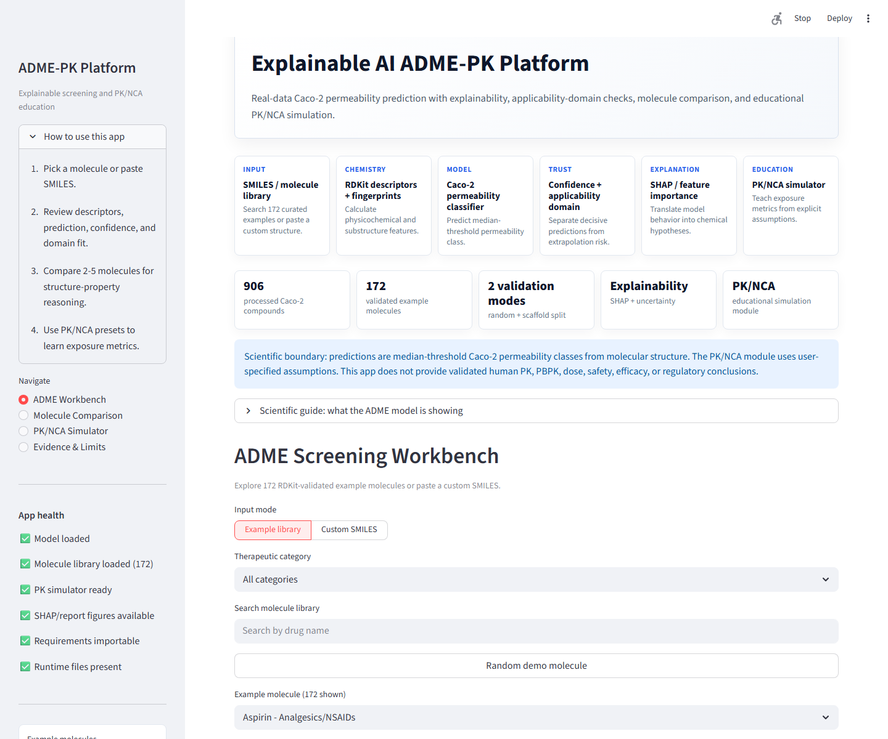
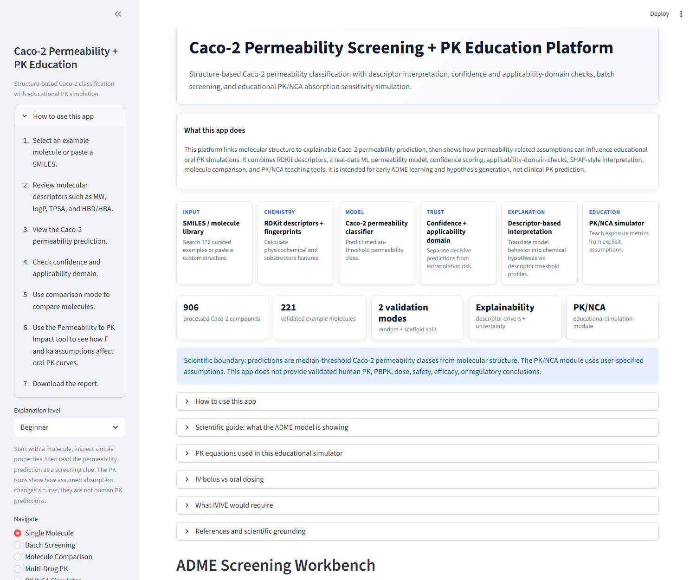
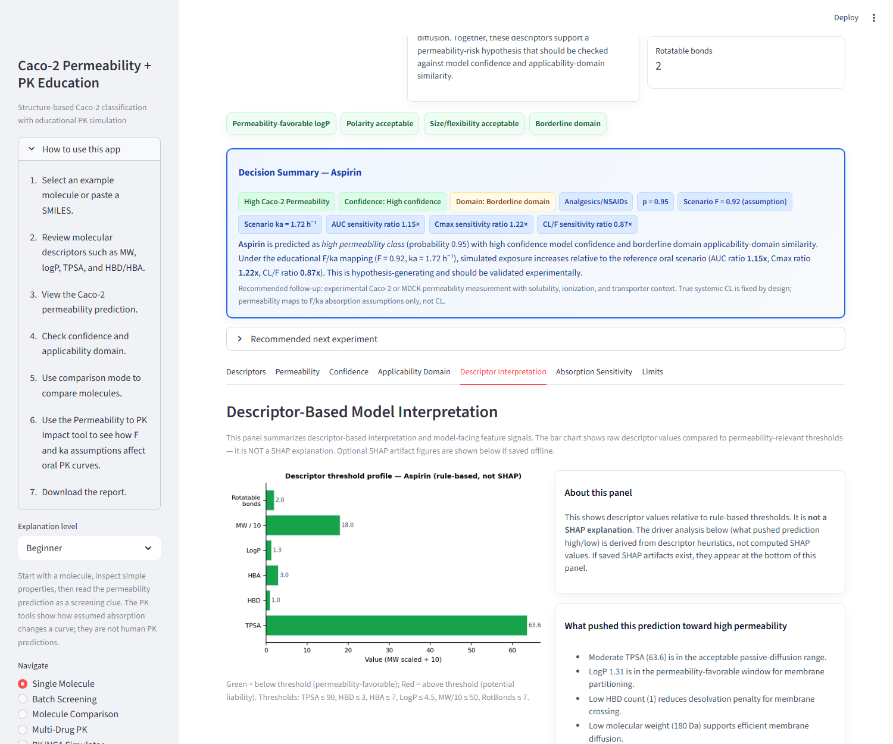
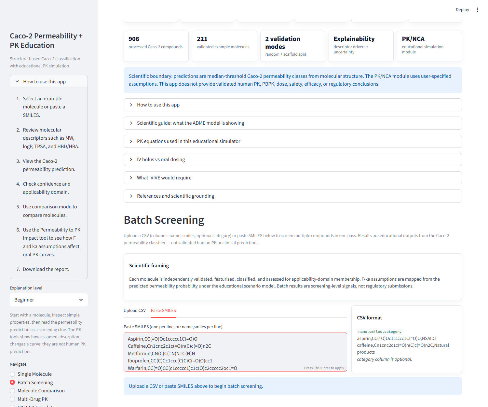
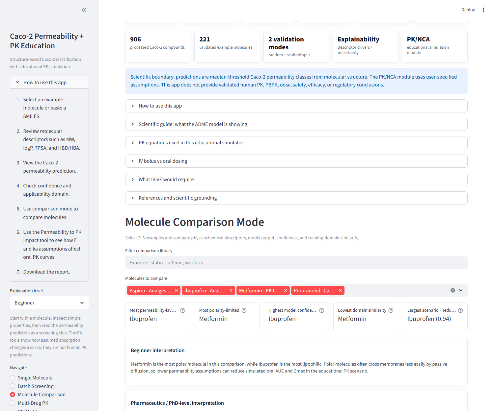
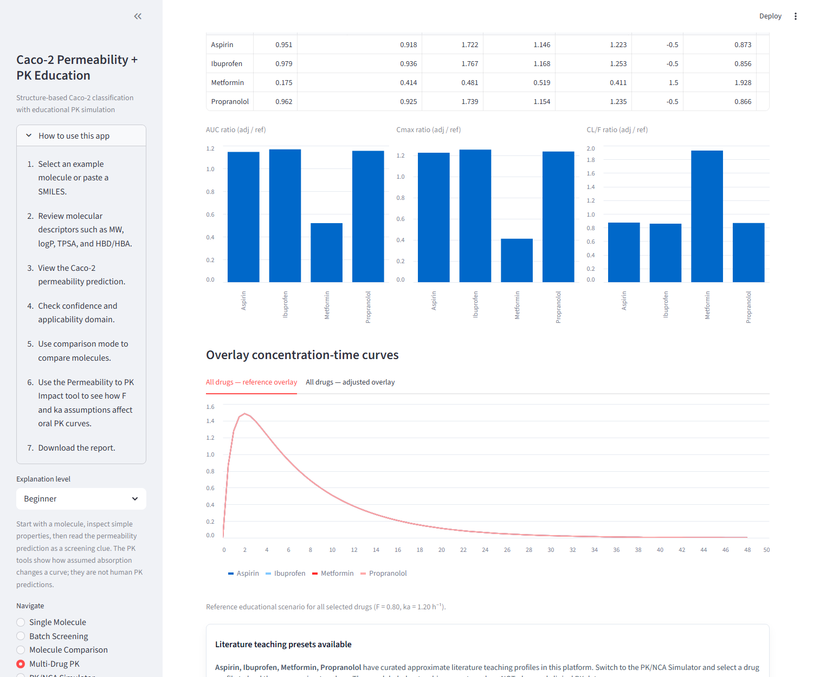
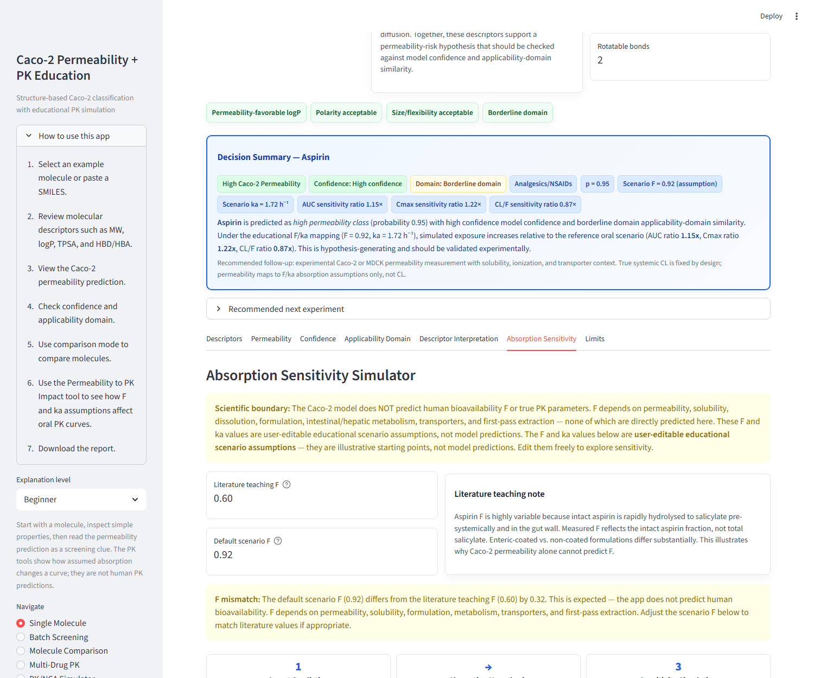
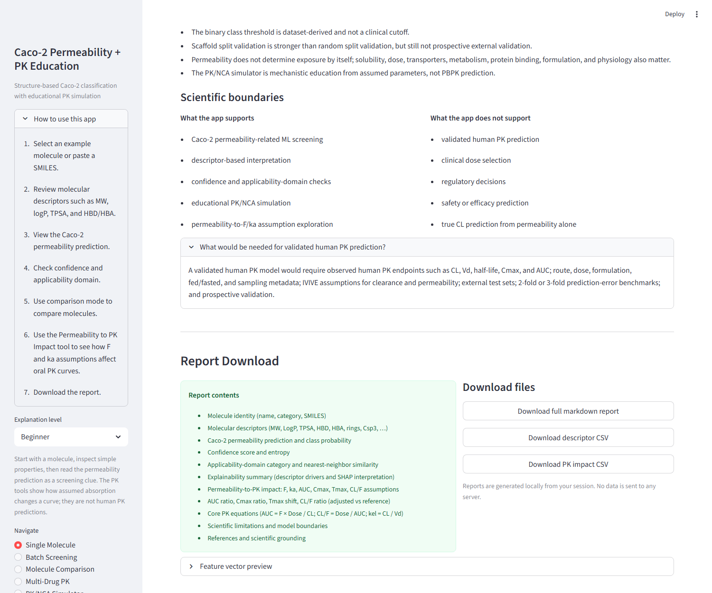

# Explainable Caco-2 Permeability Screening + PK Education Platform


An open-source platform for Caco-2 permeability classification from molecular structure, with confidence scoring, applicability-domain checks, batch screening, descriptor-based interpretation, and educational PK/NCA sensitivity simulation.

> **Scientific scope:** This platform predicts Caco-2 permeability class from molecular structure. It does **not** predict validated human oral bioavailability F, validated human PK, or PBPK parameters. PK/NCA outputs use user-specified assumptions and are for educational use only.

---

## Live App

**Live demo:** `<insert Streamlit Cloud URL after deployment>`

---

## Screenshots

| Home dashboard | Single molecule profile |
|---|---|
|  |  |

| Descriptor-based interpretation | Batch screening results |
|---|---|
|  |  |

| Molecule comparison | Multi-drug PK overlay |
|---|---|
|  |  |

| Absorption sensitivity simulator | Report download |
|---|---|
|  |  |

---

## Why this project matters

Early drug discovery requires fast, interpretable, and scientifically honest assessment of permeability-related risk. Caco-2 is a workhorse in vitro assay for passive membrane transport, but a Caco-2 result alone does not determine human oral bioavailability — which also depends on solubility, dissolution, efflux transporters, first-pass metabolism, and formulation.

This platform is designed to demonstrate that distinction explicitly: the ML model predicts a Caco-2 permeability class; the PK simulator shows how absorption **assumptions** (not model predictions) affect oral exposure calculations. Confidence scoring and applicability-domain checks provide the trust layer that raw ML probabilities alone cannot.

Batch screening mode reflects the real workflow in pharma early discovery, where many compounds need to be triaged simultaneously before any wet-lab resource is committed.

---

## What the app does

| Capability | Description |
|---|---|
| Single molecule screening | SMILES input → descriptor calculation → Caco-2 classification → confidence → applicability domain |
| Batch SMILES screening | CSV upload or paste of 50+ compounds; per-compound prediction, confidence, domain check, scenario F/ka |
| Example molecule library | 221 RDKit-validated molecules across 18 therapeutic categories |
| Descriptor profiling | MW, logP, TPSA, HBD/HBA, rotatable bonds, Csp3, rings, Lipinski/ADME flags |
| Caco-2 prediction | XGBoost classifier, probability output, confidence category, entropy |
| Applicability domain | Tanimoto nearest-neighbour similarity to training set, explicit domain-shift warning |
| Descriptor-based interpretation | Rule-based threshold profile; identifies physicochemical drivers of prediction |
| Molecule comparison | Side-by-side comparison of 2–10 molecules across physicochemical, model & trust, and PK assumption tabs |
| PK/NCA simulator | IV bolus/infusion, oral one-compartment; 26 curated literature teaching profiles; NCA metrics |
| Absorption sensitivity simulator | User-editable scenario F and ka; reference vs adjusted oral PK overlay; AUC/Cmax/Tmax/CL/F ratios |
| Multi-drug PK comparison | Select 2–5 molecules; overlay permeability-informed oral PK curves with ratio table |
| Report downloads | Per-molecule markdown + CSV; multi-drug comparison report and metrics CSV |

---

## What the app does NOT do

> Read this section before presenting the app to a clinical, regulatory, or patient-facing audience.

- Does **not** predict human oral bioavailability F
- Does **not** predict validated human pharmacokinetics
- Does **not** perform validated PBPK modeling
- Does **not** support clinical, regulatory, safety, efficacy, or dose decisions
- Does **not** replace experimental Caco-2 permeability assays
- Does **not** compute live SHAP values at inference time (SHAP analyses were generated offline; descriptor-based interpretation is shown instead)

---

## Scientific workflow

```
SMILES string or batch CSV
        │
        ▼
RDKit validation + canonicalization
        │
        ▼
Physicochemical descriptors
(MW, logP, TPSA, HBD/HBA, rings, Csp3, Morgan fingerprints)
        │
        ▼
Caco-2 permeability classifier (XGBoost)
        │
        ├── Confidence score (entropy + probability margin)
        ├── Applicability domain (Tanimoto nearest-neighbour)
        └── Descriptor-based interpretation (rule-based threshold profile)
                │
                ▼
        Scenario F/ka assumptions
        (NOT model predictions — user-editable educational starting point)
                │
                ▼
        Absorption sensitivity simulation
        (one-compartment oral PK, AUC/Cmax/Tmax/CL/F ratios)
                │
                ▼
        Downloadable report (markdown + CSV)
```

---

## Installation

### Prerequisites

- Python 3.9 or higher
- pip

### Windows

```bash
git clone <repository-url>
cd ai-pbpk-adme-predictor
python -m venv .venv
.venv\Scripts\activate
pip install -r requirements.txt
```

### macOS / Linux

```bash
git clone <repository-url>
cd ai-pbpk-adme-predictor
python -m venv .venv
source .venv/bin/activate
pip install -r requirements.txt
```

---

## Run the app

```bash
streamlit run app/streamlit_app.py
```

Open [http://localhost:8501](http://localhost:8501) in your browser.

---

## Run tests

```bash
python -m pytest
```

179+ tests covering scientific correctness (AUC ratios, CL/F invariance, scenario F bounds) and software correctness (descriptor calculation, confidence scoring, SMILES validation).

---

## Batch screening example

Create a CSV file:

```csv
name,smiles,category
Aspirin,CC(=O)Oc1ccccc1C(=O)O,NSAIDs
Caffeine,Cn1cnc2c1c(=O)n(C)c(=O)n2C,Natural products
Metformin,CN(C)C(=N)N=C(N)N,Antidiabetic
Ibuprofen,CC(C)Cc1ccc(C(C)C(=O)O)cc1,NSAIDs
Warfarin,CC(=O)CC(c1ccccc1)c1c(O)c2ccccc2oc1=O,Anticoagulants
```

Upload via the **Batch Screening** page → **Upload CSV** tab, or paste directly into the **Paste SMILES** tab.

---

## Repository structure

```text
app/                          Streamlit interface (main entry point)
  streamlit_app.py
data/
  raw/                        TDC Caco2_Wang raw dataset
  processed/                  Preprocessed/canonicalized dataset
docs/
  architecture.md             System architecture
  beginner_usage_guide.md     Non-specialist walkthrough
  data_card.md                Dataset documentation
  methods.md                  Computational methods
  model_card.md               Model card
  pk_nca_guide.md             PK/NCA education guide
  open_source_release_checklist.md
  screenshots/                App screenshots (10 curated)
models/
  baseline_permeability_classifier.joblib
  baseline_feature_columns.joblib
  baseline_permeability_regressor.joblib
notebooks/
  01_dataset_qc_and_eda.ipynb
reports/
  baseline_metrics.csv        Model performance metrics
  scaffold_split_comparison.md
  shap_interpretation.md      Offline SHAP analysis (XGBoost)
  technical_report.md
  language_claims_audit.md    Claim safety audit
  interview_pitch.md          Resume / pitch materials
  screenshot_qc_report.md
  release_qc_report.md        Automated QC output
  figures/                    Publication-quality figures
scripts/
  capture_streamlit_screenshots.py
  qc_release_check.py         Release QC automation
src/adme_predictor/
  applicability.py            Applicability domain
  demo_model.py               Model loading + fallback
  drug_pk_profiles.py         26 literature teaching profiles
  education.py                PK education, scenario F/ka, reports
  example_molecules.py        221 example molecules
  features.py                 RDKit descriptors + fingerprints
  modeling.py                 ML training pipeline
  nca.py                      NCA calculations
  pk.py                       One-compartment PK simulation
  pk_visualization.py         Plot generation
  reporting.py                SVG rendering, report formatting
  uncertainty.py              Confidence scoring
tests/                        179+ automated tests
```

---

## Model and data

| Field | Value |
|---|---|
| Dataset | TDC Caco2_Wang benchmark (Wang et al., J. Chem. Inf. Model. 2016) |
| Endpoint | Experimental Caco-2 log(Papp) in cm/s |
| Processed molecules | 906 RDKit-canonicalized structures |
| Classification threshold | Dataset training-split median log(Papp) |
| Best classifier | XGBoost |
| Random split AUROC | 0.946 |
| Random split F1 | 0.863 |
| Scaffold split AUROC | 0.934 |
| Scaffold split F1 | 0.841 |

See `docs/data_card.md` for full dataset documentation and `docs/model_card.md` for the model card.

---

## PK/NCA equations

The following equations are used in the educational simulation modules. All parameters are user-specified or literature-teaching assumptions unless explicitly stated.

```
IV bolus:          C(t) = Dose/Vd × exp(-kel × t)
Oral absorption:   C(t) = (F × Dose × ka) / [Vd × (ka-kel)] × [exp(-kel×t) - exp(-ka×t)]
Elimination:       kel = CL / Vd
IV AUC:            AUC_IV = Dose / CL
Oral AUC:          AUC_oral = F × Dose / CL
Apparent CL:       CL/F = Dose / AUC_oral
Half-life:         t½ = ln(2) / lambda_z
MRT:               MRT = AUMC / AUC
Vss (IV):          Vss = Dose × AUMC / AUC²
```

**F and ka are educational scenario assumptions, not ML predictions.** The Caco-2 classifier maps to default F and ka starting values for illustration; users can edit them freely. True systemic clearance CL remains fixed unless the user explicitly changes it.

---

## Limitations

- Caco-2 Papp is an in vitro assay endpoint, not a clinical absorption endpoint.
- The median-threshold binary classification is dataset-specific, not a regulatory or clinical cutoff.
- Scaffold split validation is stricter than random split but is not a prospective external validation.
- Confidence scores reflect classifier certainty, not clinical certainty.
- Applicability-domain warnings depend on fingerprint similarity and cannot detect every reliability issue.
- PK/NCA simulations use assumed parameters and are educational only.
- SHAP values were generated offline for the trained XGBoost model; they are not recomputed at inference time.
- Human bioavailability F depends on permeability, solubility, dissolution, efflux transporters, hepatic metabolism, and formulation — Caco-2 alone cannot predict it.

---

## Roadmap

- SHAP integration at inference time (requires SHAP artifact streaming or on-demand computation)
- Additional curated literature PK profiles with explicit citations
- Solubility endpoint integration (e.g., AqSolDB benchmark)
- External validation on additional public ADME benchmarks
- Model calibration and conformal prediction confidence intervals
- Observed C-t curve overlay support (requires actual clinical PK data with source citation)

---

## Citation

If you use this project, please cite:

```bibtex
@software{achou2025caco2,
  author = {Achou, Emile},
  title  = {Explainable Caco-2 Permeability Screening + PK Education Platform},
  year   = {2025},
  url    = {https://github.com/<your-github-username>/ai-pbpk-adme-predictor},
}
```

Also cite the underlying data and tools:

- Wang, N.-N. et al. *J. Chem. Inf. Model.* 2016, 56, 763–786 (Caco-2 dataset)
- Huang, K. et al. *Advances in NeurIPS Track on Datasets and Benchmarks.* 2021 (TDC)
- RDKit: Open-source cheminformatics. https://www.rdkit.org/
- Chen, T. & Guestrin, C. *KDD 2016* (XGBoost)

---

## License

MIT License — see [LICENSE](LICENSE) for details.

Data in `data/` is from the TDC Caco2_Wang benchmark. See https://tdcommons.ai for dataset terms.

---

## Author

**Emile Achou**

Contact: emileachou1@gmail.com
